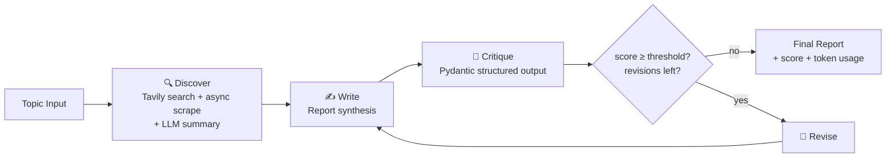

# 🔬 ResearchMind: Self-Correcting Multi-Agent Research System

[](./.github/workflows/ci.yml)
[](pyproject.toml)
[](pyproject.toml)
[](pyproject.toml)
[](#-license)

An autonomous research pipeline built on a **LangGraph state machine**, **Groq LPU inference**, and **Pydantic structured outputs**. Specialized agents discover sources, scrape them concurrently, synthesize a structured report — then a critic **scores the report and triggers an automatic revision loop** until quality clears the threshold (or the revision budget is spent).

## ✨ Highlights

- **LangGraph state machine** — `discover → write → critique → (revise?) → …` with a conditional self-correction loop, not a linear script.
- **Pydantic structured outputs** — the critic returns a validated `Critique` model (score, strengths, improvements, verdict); malformed LLM output can't crash the run.
- **Concurrent async scraping** — top sources fetched in parallel with httpx under a bounded semaphore.
- **Real observability** — per-run token usage, wall time, revision count and critic score surfaced in the UI; structured JSON logging optional.
- **TTL-cached search** — repeated topics don't burn Tavily quota.
- **Production hygiene** — typed `pydantic-settings` config, testable package layout (`src/`), pytest suite with mocked Tavily/HTTP/LLM, ruff + mypy + pytest enforced in CI, Dockerfile for one-command deploys.

## 🏗 Architecture



The **revise edge is the differentiator**: the writer receives the critique's `improvements` list as explicit revision instructions, so drafts measurably improve across iterations.

## 📋 Requirements

- Python **3.10+**
- **Groq API key** (free): [console.groq.com/keys](https://console.groq.com/keys)
- **Tavily API key** (free tier): [app.tavily.com](https://app.tavily.com/)

## 🚀 Quickstart

```bash
# 1. Install (creates an editable install with dev tools)
pip install -e ".[dev]"

# 2. Configure keys
cp .env.example .env        # then edit .env

# 3a. Run the web UI
streamlit run app.py

# 3b. Or the CLI
researchmind "solid-state battery commercialization"
python -m researchmind.cli "impact of quantum error correction"   # equivalent
```

## 🧪 Development

```bash
ruff check src tests app.py          # lint
mypy src                             # static types
pytest --cov=src/researchmind        # tests with coverage
```

All external services (Tavily, web pages, LLMs) are faked in tests — the suite runs fully offline and deterministically.

## 🎯 Evals

Tests prove the code *runs*; evals prove the *output is still good*. The eval harness is a golden-set regression suite for AI behavior:

```bash
researchmind-evals                              # offline golden-set suite (free, CI-safe)
python -m researchmind.live_evals "topic"       # live run vs the rubric (uses API quota)
```

The rubric checks: required report sections, minimum length, source citations, critic score validity, and — the money check — that **a revision actually improves the critic's score**. If a prompt or model change silently breaks the self-correction loop, the evals go red while unit tests stay green. Offline evals run in CI on every push.

## 🐳 Docker

```bash
docker build -t researchmind .
docker run -p 8501:8501 --env-file .env researchmind
```

## 📁 Project Structure

```
├── app.py                       # Streamlit UI (thread + queue event streaming)
├── src/researchmind/
│   ├── config.py                # pydantic-settings configuration
│   ├── logging_conf.py          # stdlib JSON/console logging
│   ├── models.py                # SearchHit, ScrapedPage, Critique, TokenUsage
│   ├── tools.py                 # cached Tavily search + async httpx scraper
│   ├── chains.py                # writer / critic chains (usage-aware)
│   ├── graph.py                 # LangGraph state machine + revision loop
│   ├── evals.py                 # golden-set eval harness (offline)
│   ├── live_evals.py            # opt-in live eval runner
│   └── cli.py                   # rich terminal client
├── tests/                       # pytest suite (offline, mocked services)
├── .github/workflows/ci.yml     # ruff + mypy + pytest
├── Dockerfile
└── pyproject.toml               # packaging + tool config
```

## ⚙️ Configuration

All settings are environment variables (see `.env.example`): `GROQ_MODEL` (default `openai/gpt-oss-120b`; use `openai/gpt-oss-20b` for lowest latency), `SEARCH_MAX_RESULTS`, `NUM_SOURCES`, `QUALITY_THRESHOLD` (default 8/10), `MAX_REVISIONS` (default 2), `LOG_LEVEL`, `LOG_JSON`.

## 🛡 License

MIT.
