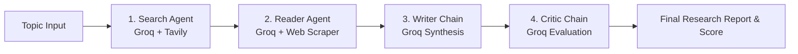

# 🔬 ResearchMind: Multi-Agent AI Research System (Powered by Groq)

A multi-agent autonomous research system built with **LangChain**, **Groq LLMs**, and **Streamlit**. It coordinates specialized AI agents to gather intelligence, scrape in-depth content from the web, synthesize a structured report, and critically evaluate the final output with extreme speed.

---

## ⚡ Why Groq?

By utilizing **Groq's LPU Inference Engine**, ResearchMind executes agentic tool calls, complex reasoning, and multi-step evaluations with near-instant response times using state-of-the-art open models such as **Llama 3.3 70B**.

---

## 🤖 Multi-Agent Architecture



1. **Search Agent**: Uses Tavily search to fetch the most relevant, up-to-date web articles and snippets for the research topic.
2. **Reader Agent**: Autonomously inspects search results, chooses top source URLs, and scrapes clean, full-text content.
3. **Writer Chain**: Synthesizes the raw search results and scraped deep content into a structured, professional research report.
4. **Critic Chain**: Evaluates the drafted report against strict criteria, scoring it out of 10 and offering constructive strengths and critique.

---

## 📋 Requirements & Prerequisites

- **Python 3.10+**
- **Groq API Key** (Free): [Get Groq API Key](https://console.groq.com/keys)
- **Tavily API Key** (Free tier available): [Get Tavily API Key](https://app.tavily.com/)

---

## 🚀 Quickstart Guide

### 1. Clone & Navigate to Project

```bash
cd Multi-agent-research-system-main
```

### 2. (Optional) Create & Activate a Virtual Environment

```bash
# Windows
python -m venv venv
venv\Scripts\activate

# macOS / Linux
python3 -m venv venv
source venv/bin/activate
```

### 3. Install Dependencies

```bash
pip install -r requirements.txt
```

### 4. Configure API Keys

Create a `.env` file in the root directory (you can copy `.env.example`):

```bash
# Windows PowerShell
copy .env.example .env

# macOS / Linux
cp .env.example .env
```

Open `.env` and fill in your keys:

```env
GROQ_API_KEY=gsk_your_groq_api_key_here
TAVILY_API_KEY=tvly-your_tavily_api_key_here
GROQ_MODEL=llama-3.3-70b-versatile
```

> **Supported Groq Models**:
> - `llama-3.3-70b-versatile` (Default, recommended for reasoning & report synthesis)
> - `llama-3.1-8b-instant` (Fastest, low latency)
> - `mixtral-8x7b-32768` (High context)

---

## 💻 Running the Application

### Option A: Interactive Streamlit Web UI (Recommended)

Launch the web interface:

```bash
streamlit run app.py
```

Open your browser at `http://localhost:8501`. Enter any topic to watch the agents execute step-by-step in real time!

### Option B: Terminal CLI Pipeline

Run the pipeline directly from your command line:

```bash
python pipeline.py
```

---

## 📁 Project Structure

```
Multi-agent-research-system/
├── app.py              # Modern Streamlit Web Application
├── agents.py           # Agent and Chain definitions using ChatGroq
├── pipeline.py         # Sequential multi-agent pipeline runner (CLI)
├── tools.py            # Custom tools (Tavily search & URL scraper)
├── requirements.txt    # Python package dependencies
├── .env.example        # Environment variable template
└── README.md           # Project documentation
```

---

## 🛡️ License

MIT License. Feel free to modify and build upon this research system!
